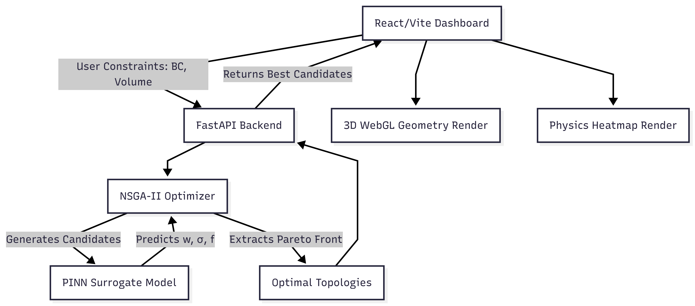
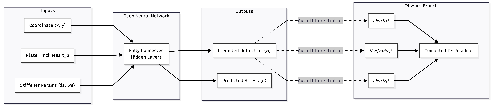

# Stiffened Plate Optimization with Physics-Informed Neural Networks and NSGA-II

A comprehensive, AI-driven computational framework for optimizing the geometry and topology of orthotropic stiffened plates. This project utilizes a Physics-Informed Neural Network (PINN) surrogate model coupled with a Non-dominated Sorting Genetic Algorithm II (NSGA-II) to perform rapid, multi-objective structural optimization without relying on computationally expensive traditional Finite Element Analysis (FEA) during the optimization loop.

---

## Table of Contents
- [Project Overview](#project-overview)
- [System Architecture](#system-architecture)
- [Workflow and Execution Pipeline](#workflow-and-execution-pipeline)
- [Physics-Informed Neural Network (PINN) Architecture](#physics-informed-neural-network-pinn-architecture)
- [Local Setup and Installation](#local-setup-and-installation)
- [Contributing](#contributing)
- [License](#license)

---

## Project Overview

The structural design of stiffened plates requires balancing conflicting objectives: minimizing displacement (deflection), minimizing equivalent stress, and maximizing natural frequency, all while adhering strictly to mass and volume constraints. 

Traditionally, this requires iterative FEA, which is computationally prohibitive for genetic algorithms that must evaluate thousands of candidates. This framework solves that bottleneck by employing a trained Physics-Informed Neural Network that instantly predicts mechanical responses based on geometry and boundary conditions, allowing the NSGA-II evolutionary algorithm to explore the vast topological design space in seconds.

---

## System Architecture

The application is built on a decoupled two-tier architecture designed for performance and scalability.

### System Workflow Diagram



### Backend Engine (FastAPI & Python)
The backend acts as the computational core. It is responsible for orchestrating the optimization pipeline.
- **Data Ingestion & Normalization**: The system handles raw geometric parameters and normalizes them using pre-calculated mean and standard deviation vectors (`x_mean.npy`, `x_std.npy`) to ensure stable neural network inference.
- **PINN Surrogate Model**: A TensorFlow/Keras based `.keras` model that accepts boundary conditions, plate thickness, and stiffener depth/width dimensions. It outputs predicted Maximum Deflection, Maximum Stress, and Natural Frequency.
- **Evolutionary Optimizer**: A `pymoo` implementation of NSGA-II. It defines the structural problem, establishes objective functions, formulates stiffener volumetric constraints, and drives the evolutionary loop.
- **Physics Heatmap Generator**: Generates mathematical surface representations of the stress and deflection distribution across the plate surface based on classical orthotropic plate equations and boundary conditions.

### Frontend Dashboard (React, Vite & Three.js)
The frontend serves as an interactive engineering dashboard.
- **State Management**: Handles user inputs for loads, dimensions, and boundary constraints.
- **3D WebGL Visualization**: Utilizes `@react-three/fiber` to procedurally render the optimal stiffened plate geometry in a 3D environment, allowing engineers to visually inspect the resulting matrix.
- **Data Analytics**: Employs `recharts` to render Pareto Front scatter plots, multi-objective radar charts, and volume distribution metrics, providing conclusive evidence of the trade-offs explored by the NSGA-II algorithm.
- **Surface Rendering**: Dynamically maps the backend's generated physics heatmaps into 3D height-mapped terrain plots to visualize deflection and stress concentrations.

---

## Workflow and Execution Pipeline

The complete end-to-end process operates as follows:

1. **Constraint Definition**: The user defines the domain (Length, Breadth, Load, Initial Thickness, Boundary Condition) via the React dashboard.
2. **Problem Initialization**: The FastAPI backend receives the payload and initializes the `StiffenedPlateProblem` class. The total allowable volume is calculated based on the initial solid plate thickness.
3. **Population Generation**: NSGA-II initializes a random population of stiffener topologies (transverse, longitudinal, or bi-directional grid patterns).
4. **Surrogate Evaluation**: For each generation, the individuals are passed through the loaded PINN model. The model predicts the mechanical responses instantaneously.
5. **Constraint Handling**: Candidates whose total volume (plate + stiffeners) exceeds the predefined limit are subjected to severe penalty functions.
6. **Selection and Evolution**: The algorithm performs non-dominated sorting, crowding distance calculation, crossover, and polynomial mutation to evolve the population over 50+ generations.
7. **Pareto Extraction**: The final Pareto front is extracted. The backend runs logic to specifically select the "Best Balanced", "Strongest", "Safest", and "Lightest" extreme candidates.
8. **Client Rendering**: The JSON payload is returned to the client, which dynamically reconstructs the 3D topology and draws the analytical graphs.
9. **3D Model Export**: Using the "Export 3D Model" button on the frontend, users can download the optimal stiffened plate geometry as an `.stl` file. This file can be directly imported into CAD software (SolidWorks, AutoCAD) or FEA software (ANSYS, Abaqus) for further structural validation or 3D printing.

---

## Physics-Informed Neural Network (PINN) Architecture

The predictive core of this framework is the Physics-Informed Neural Network. Traditional neural networks act as empirical black boxes, learning strictly from data interpolation, which makes them unreliable for engineering applications where out-of-bounds predictions can lead to structural failure. Our PINN solves this by ensuring that all predictions strictly obey the fundamental laws of continuum mechanics.

### Network Topology and Flow



### Dual-Branch Network Architecture
The PINN is constructed using a bifurcated, dual-branch architecture implemented in TensorFlow/Keras:

1. **Surrogate Data Branch (Empirical):**
   - **Inputs:** Boundary Condition (`bc`), Plate Thickness (`tp`), Stiffener depths (`dsx`, `dsy`), and widths (`wsx`, `wsy`).
   - **Structure:** A Deep Multi-Layer Perceptron (MLP) consisting of fully connected layers with `ReLU` activation functions.
   - **Function:** Learns the complex, high-dimensional, non-linear mapping directly from the FEA-derived training dataset to predict deflection, stress, and natural frequency.

2. **Physics-Informed Branch (Analytical):**
   - **Inputs:** Spatial coordinates `(x, y)` and the predicted displacement field `w(x, y)`.
   - **Structure:** Employs TensorFlow's `GradientTape` to perform automatic differentiation. This allows the network to analytically compute exact, continuous spatial derivatives up to the 4th order without relying on discrete numerical mesh approximations.
   - **Function:** Evaluates whether the predicted displacement field mathematically satisfies the equilibrium equations of solid mechanics.

### The Governing Physics (Orthotropic Plate Theory)
To evaluate the physical validity of a predicted design, the network calculates a "Physics Residual" based on the classical governing partial differential equation (PDE) for orthotropic plates under transverse loading:

`D_x * (∂⁴w / ∂x⁴) + 2H * (∂⁴w / ∂x²∂y²) + D_y * (∂⁴w / ∂y⁴) = q(x,y)`

Where:
- `w(x, y)` is the predicted transverse deflection field.
- `q(x, y)` is the applied uniform transverse load.
- `D_x` and `D_y` are the effective flexural rigidities of the stiffened plate in the longitudinal and transverse directions.
- `H` is the effective torsional rigidity, defined as `H = D_xy + 2D_k`, where `D_xy` is the cross-rigidity and `D_k` is the torsional stiffness of the stiffeners.

### Deep Dive: The Physics-Guided Loss Function
During training, the loss function is not merely the Mean Squared Error (MSE) of the predictions versus the training data. Instead, it is a composite loss function:

`L_total = L_data + λ * L_physics`

#### 1. Data Loss (`L_data`)
`L_data = (1/N) * Σ [(w_pred - w_fea)² + (σ_pred - σ_fea)²]`
This is the empirical component. It measures how closely the PINN's predictions match the ground-truth results derived from ANSYS/FEA simulations. It forces the network to learn the "baseline" correct answers for specific training cases.

#### 2. Physics Loss (`L_physics`)
`L_physics = (1/N_c) * Σ [D_x(∂⁴w/∂x⁴) + 2H(∂⁴w/∂x²∂y²) + D_y(∂⁴w/∂y⁴) - q]²`
This is the analytical component. During training, the network is asked to evaluate random "collocation points" (`N_c`) anywhere on the plate's surface—even points where we have zero FEA data. 
At these random points, the network uses its own predicted displacement curve `w(x,y)` and takes the 4th-order derivative. If that derivative does not perfectly balance the external load `q` (meaning the equilibrium equation is violated), the `L_physics` error skyrockets. 

#### 3. Why this matters (The Weighting Factor `λ`)
By incorporating `L_physics`, the network cannot just "memorize" data points or guess random curves between them (a common flaw in standard AI called hallucination). The AI is mathematically constrained; it *must* draw a displacement curve that perfectly satisfies solid mechanics everywhere on the plate. This is what makes the PINN extraordinarily accurate, allowing it to act as a true engineering surrogate rather than just a statistical estimator.

---

## Local Setup and Installation

### Prerequisites
- Python 3.8+
- Node.js 16+ and npm

### Backend Environment
Navigate to the root directory and install the necessary Python dependencies:
```bash
pip install -r requirements.txt
```

Ensure that `pinn_plate_model.keras`, `x_mean.npy`, and `x_std.npy` are present in the root directory.

Start the application server:
```bash
python main.py
```
The FastAPI instance will launch on `http://127.0.0.1:8000`.

### Frontend Environment
Open a separate terminal instance and navigate to the `frontend` directory:
```bash
cd frontend
npm install
npm run dev
```
The client interface will be available at `http://localhost:5173`.

---

## Contributing

Contributions are welcome. Please fork the repository and submit a pull request with your enhancements. For major changes, please open an issue first to discuss what you would like to change.

## License

This project is licensed under the MIT License. See the LICENSE file for details.
